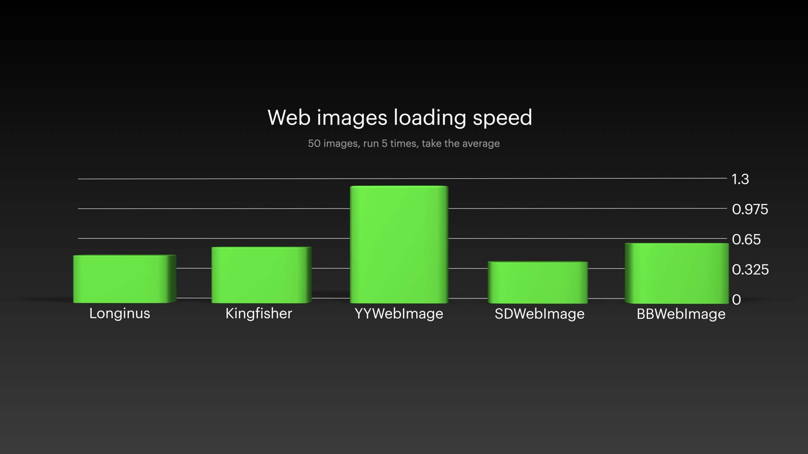
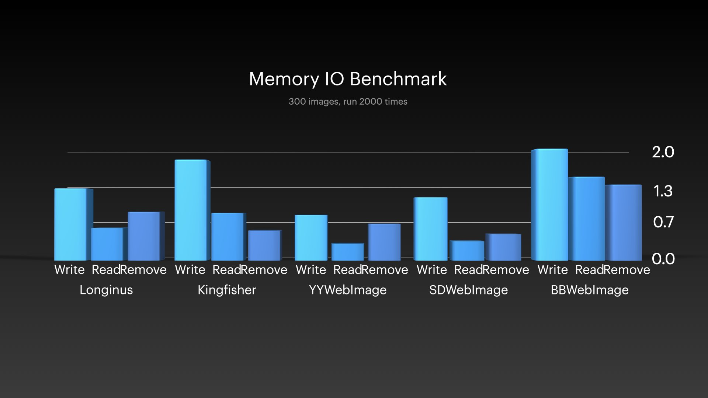
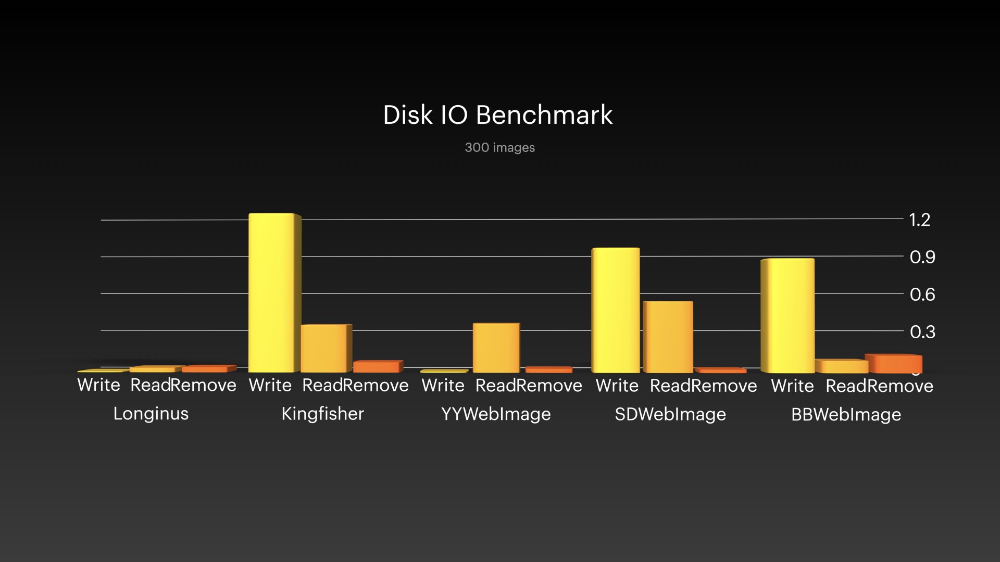

<p align="center">
<a href="https://github.com/KittenYang/Longinus">

</a>
</p>
<p align="center">
  <a href="https://travis-ci.org/kittenyang@icloud.com/Longinus">
    <a href="https://github.com/KittenYang/Longinus/actions?query=workflow%3Abuild"></a>
  </a>
  <a href="https://cocoapods.org/pods/Longinus">
    
  </a>
  <a href="https://cocoapods.org/pods/Longinus">
    
  </a>
  <a href="https://cocoapods.org/pods/Longinus">
    
  </a>
</p>


# Longinus
Longinus is a pure-Swift high-performance asynchronous web image loading,caching,editing framework.

It was learned from Objective-C web image loading framework [YYWebImage](https://github.com/ibireme/YYWebImage) and [BBWebImage](https://github.com/Silence-GitHub/BBWebImage), bring lots of high performace features to Swift. It may become a better choice for you.

Longinus's goal is to become the Highest-Performance web image loading framework on Swift.

## Feature
* Asynchronous image downloading and caching.
* Preload images and cache them to disk for further showing.
* Animated GIF support (dynamic buffer, lower memory usage).
* Baseline/progressive/interlaced image decode support.
* View extensions for UIImageView, UIButton, MKAnnotationView(not yet) and CALayer to directly set an image from a URL.
* Image loading category for UIImageView, UIButton and CALayer.
* Built-in transition animation when setting images.(or you can set your custom image showing transion)
* Image Transform after downloading supported: blur, round corner, resize, color tint, crop, rotate and more.
* High performance memory and disk image cache. Use LRU algorithm to manage. For disk cache, it use file system and sqlite for better performance.
* Use FIFO queue to handle image downloading operation.
* Smooth sliding without UI lags. High performance image caching and decoding to avoid main thread blocked.

## Usage

The simplest use-case is setting an image to an image view with the UIImageView extension:
```swift
let url = URL(string: "http://github.com/logo.png")
imageView.lg.setImage(with: url)
```
Load animated gif image:
```swift
let url = URL(string: "https://ww4.sinaimg.cn/bmiddle/eaeb7349jw1ewbhiu69i2g20b4069e86.gif")
imageView.lg.setImage(with: url)
```
Load image progressively:
```swift
let url = URL(string: "http://github.com/logo.png")
imageView.lg.setImage(with: url, options: [.progressiveBlur, .imageWithFadeAnimation])
```
Load and transform image:
```swift
let url = URL(string: "https://ww4.sinaimg.cn/bmiddle/eaeb7349jw1ewbhiu69i2g20b4069e86.gif")
let transformer = ImageTransformer.imageTransformerCommon(with: imageView.frame.size, borderWidth: 2.0, borderColor: .white)
imageView.lg.setImage(with: url, options: [.progressiveBlur, .imageWithFadeAnimation], transformer: transformer)
```

# Requirements
* iOS 9.0+
* Swift 5.0+

# Installation
## CocoaPods

Longinus is available through [CocoaPods](https://cocoapods.org). To install it, simply add the following line to your Podfile:
```ruby
source 'https://github.com/CocoaPods/Specs.git'
platform :ios, '9.0'
use_frameworks!

target 'MyApp' do
  # your other pod
  # ...
  pod 'Longinus'
end
```
Then, run the following command:

```
$ pod install
```

You should open the {Project}.xcworkspace instead of the {Project}.xcodeproj after you installed anything from CocoaPods.

For more information about how to use CocoaPods, I suggest this [tutorial](http://www.raywenderlich.com/64546/introduction-to-cocoapods-2).

# Benchmark
I tested some popular web image loading frameworks on iOS platform from some aspects.
* Image loading speed. 
* Memory&Disk read/write/delete speed.
* Scrolling 4000 images UI fps.

Here is the tested results. 

*Note: The test device is iPhone 11, running on iOS 13.3*








You can git clone this repo and run the `Benchmark.xcworkspace` to test it by yourself.

## License

Longinus is available under the MIT license. See the LICENSE file for more info.

